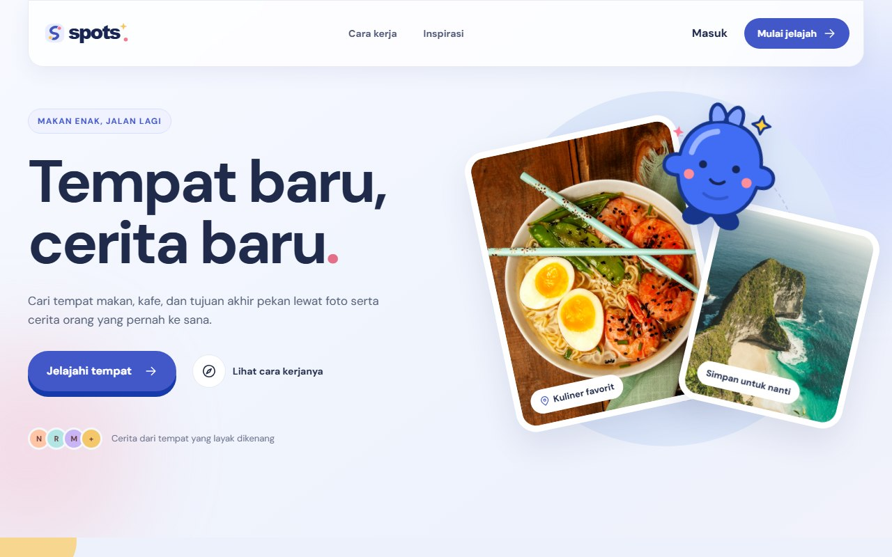
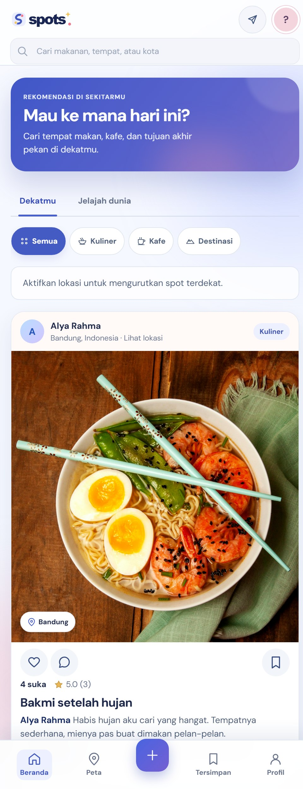
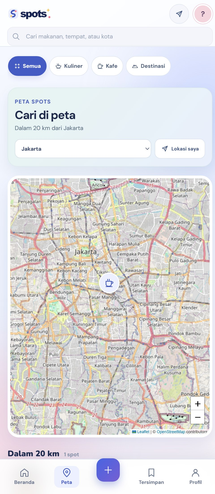

# Spots

Spots adalah tempat berbagi rekomendasi yang berangkat dari pengalaman orang lain. Isinya bisa warung makan, kafe, tempat singgah, atau tujuan perjalanan. Setiap cerita punya foto atau video dan titik lokasi, jadi orang lain bisa melihat tempatnya sebelum memutuskan untuk datang.

## Tampilan aplikasi



<p align="center">
  
  
</p>

## Yang bisa dilakukan

- Melihat tempat dalam radius 20 km dari lokasi saat ini. Jika lokasi belum diizinkan, feed menampilkan tempat yang populer.
- Menjelajah rekomendasi dari kota lain berdasarkan suka, simpan, komentar, dan rating.
- Membuka peta, memilih kota, lalu melihat foto, rating, suka, dan komentar dari setiap pin.
- Mengunggah satu sampai lima foto atau video dalam satu postingan, lengkap dengan cerita dan koordinat.
- Memberi rating, berkomentar, menyukai, dan menyimpan tempat setelah masuk ke akun.
- Melihat postingan sendiri dan daftar tempat tersimpan di profil.

Tampilan dibuat untuk ponsel lebih dulu. Di layar lebar, navigasi berpindah ke sidebar dan feed memiliki panel tambahan.

## Menjalankan proyek

Butuh Node.js 22.13 atau lebih baru dan MySQL 8. Buat database, siapkan akun aplikasi, lalu isi konfigurasi lokal.

```sql
CREATE DATABASE spots_to_go CHARACTER SET utf8mb4 COLLATE utf8mb4_unicode_ci;
CREATE USER 'spots_app'@'127.0.0.1' IDENTIFIED BY 'password';
GRANT ALL PRIVILEGES ON spots_to_go.* TO 'spots_app'@'127.0.0.1';
```

Salin `.env.example` menjadi `.env`, isi `DB_PASSWORD`, lalu jalankan:

```bash
npm install
npm start
```

Buka [http://localhost:3000](http://localhost:3000). Server membuat tabel dari `schema.sql` saat mulai. Jika memakai MySQL di port 3307 bersama XAMPP, ubah `DB_PORT` di `.env` menjadi `3307`.

Untuk melihat tampilan tanpa MySQL, jalankan `npm run preview` dan buka [http://localhost:3100](http://localhost:3100). Mode ini hanya untuk meninjau antarmuka. Akun, unggahan, dan interaksi yang tersimpan memerlukan server MySQL.

## Dokumentasi

| Dokumen | Isi |
| --- | --- |
| [Produk dan alur](docs/PRODUCT.md) | Layar, perjalanan pengguna, dan aturan rekomendasi |
| [Instalasi lokal](docs/SETUP.md) | Konfigurasi MySQL, Workbench, dan pemecahan masalah |
| [Arsitektur](docs/ARCHITECTURE.md) | Alur browser, server, database, media, dan peta |
| [API](docs/API.md) | Endpoint, autentikasi, batas unggahan, dan contoh respons |
| [Database](docs/DATABASE.md) | Relasi tabel, data awal, dan contoh penyuntingan manual |
| [Frontend](docs/FRONTEND.md) | Navigasi, komponen, perilaku mobile, dan animasi |
| [Operasi](docs/OPERATIONS.md) | Penyimpanan, pemeriksaan layanan, backup, dan kesiapan publik |

## Susunan berkas

`index.html`, `style.css`, dan `app.js` menjalankan antarmuka. `server.mjs` menyediakan API serta berkas statis. `schema.sql` menyimpan struktur database. Foto dan video unggahan berada di `uploads/`; folder ini dan `.env` tidak masuk Git.

Saat database kosong, server mengisi sejumlah postingan awal dengan penanda `is_demo=1`. Koordinat dan cerita awal dipakai untuk mencoba alur aplikasi, bukan rekomendasi lokasi yang telah diverifikasi. Cara mengenali dan mengelolanya ada di [dokumentasi database](docs/DATABASE.md).
